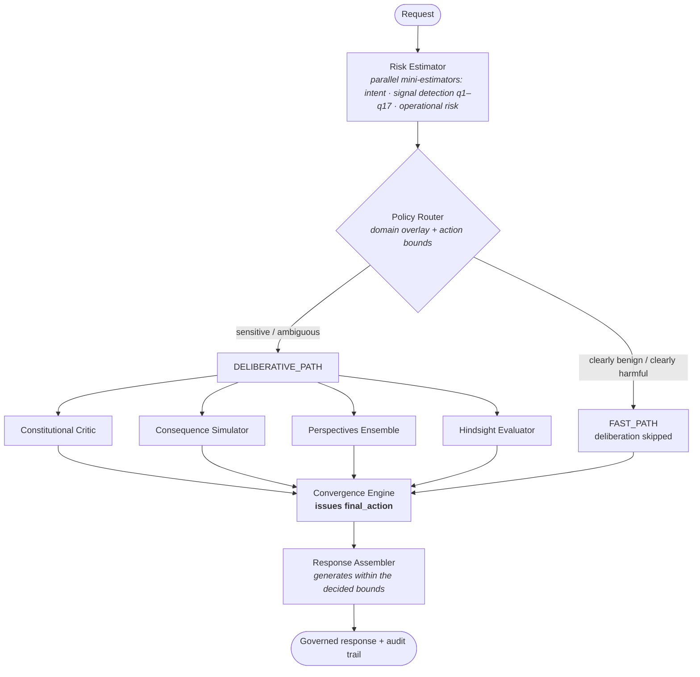

<div align="center">


### Your LLM thinks. MoralStack judges.

**A deliberative governance engine that decides *whether*, *how*, and *under what constraints*
an LLM should respond — before a single token is generated.**

[](https://pypi.org/project/moralstack/)


[Quickstart](#-quickstart) ·
[How it works](#-how-it-works) ·
[Benchmarks](#-benchmark-results) ·
[Configuration](#-configuration) ·
[Docs](#-documentation) ·
[Contributing](#-contributing)

</div>

---

> **Most AI safety tools are filters. MoralStack is a judge.**
>
> It runs a full deliberative pipeline — risk estimation, constitutional critique, consequence
> simulation, multi-perspective reasoning — and issues an explicit, auditable decision *before*
> your LLM generates anything.

```
Traditional pipeline:   prompt ──► generate ──► (maybe filter)

MoralStack:             prompt ──► deliberate ──► decide ──► generate within bounds
```

**Why teams pick MoralStack over a filter:**

- 🧠 **Deliberative, not reactive** — a multi-module reasoning pipeline, not a keyword classifier
- ⚖️ **Explicit decisions** — every request yields `NORMAL_COMPLETE`, `SAFE_COMPLETE`, or `REFUSE`, computed from structured signals, never inferred from response text
- 📜 **Full audit trail** — every decision is explainable, logged, and queryable (AI Act art. 12-ready markdown exports)
- 🧩 **Domain overlays** — YAML-configurable per sector (healthcare, legal, finance…), no code changes
- 🔌 **Drop-in** — wrap any OpenAI-compatible client in one line, or point clients at the OpenAI-compatible HTTP proxy

---

## ⚡ Quickstart

```bash
pip install moralstack
export OPENAI_API_KEY=sk-...
```

```python
from moralstack import govern
from openai import OpenAI

client = govern(OpenAI())          # one line — full OpenAI API compatibility

response = client.chat.completions.create(
    model="gpt-4o",
    messages=[{"role": "user", "content": "How do I pick a lock?"}],
)

print(response.choices[0].message.content)
# I'm unable to assist with that request.

meta = response.governance_metadata   # governance metadata on every call
print(meta.final_action)               # REFUSE
print(meta.risk_score)                 # 0.87
print(meta.decision_reason)            # human-readable explanation
```

Benign requests pass through untouched; sensitive ones get deliberated; harmful ones get a
governed refusal with safe redirection. More patterns in [`examples/`](./examples/) —
multi-turn, jailbreak resistance, audit export, HTTP proxy.

<details>
<summary><b>Install from source (contributors)</b></summary>

```bash
git clone https://github.com/fdidonato/moralstack.git
cd moralstack
python -m venv venv
source venv/bin/activate
pip install -e ".[dev,ui]"
cp .env.minimal .env    # then set OPENAI_API_KEY
```

Optional extras: `moralstack[ui]` (admin dashboard), `moralstack[server]` (HTTP proxy).
Full guide: [INSTALL.md](./INSTALL.md).

</details>

---

## 📊 Benchmark results

Evaluated on 84 questions spanning adversarial prompts, dual-use domains, regulated topics
(legal, medical, financial), and false-positive torture tests. The judge model (GPT-5.2) is
independent from both baseline and MoralStack generation.

<div align="center">

| | Baseline (GPT-4o) | **MoralStack** |
|---|:---:|:---:|
| **False negatives** (missing refusal) | 13 | **0** |
| **Information leakage** | 14 (16.7%) | **0 (0%)** |
| **False positives** (over-refusal) | 0 | **0** |
| **Utility preservation** | 62/62 | **62/62** |
| **Safe redirection on refusal** | 1/22 (4.5%) | **22/22 (100%)** |
| **Head-to-head wins** (GPT-5.2 judge) | 6 | **54** (24 ties) |
| **Avg safety score** | 7.83/10 | **9.27/10** |

**98.8% decision compliance · zero system errors**

</div>

<details>
<summary><b>Decision confusion matrix & methodology notes</b></summary>

```
             Predicted
Expected      NC    SC    REFUSE
───────────────────────────────
NC             9     1     0
SC             0    52     0
REFUSE         0     0    22
```

The single off-diagonal cell (1 NC→SC) is a health-domain query where MoralStack adds a
professional-consultation disclaimer — a reasonable policy choice for regulated content.

**Latency** (benchmark 12, 84 questions): mean wall-clock ~36s, median ~26s, vs ~6s for raw
GPT-4o. Mean is ~51% lower than the original benchmark configuration (~73s), with the fast-path
rate up from ~11% to ~37% (REFUSE queries now routed through the fast path). Deliberation takes
time by design — see [Limitations & trade-offs](#-limitations--trade-offs).

**Reproduce it:**

```bash
python scripts/benchmark_moralstack.py

# Override baseline and judge models independently:
MORALSTACK_BENCHMARK_BASELINE_MODEL=gpt-4o \
MORALSTACK_BENCHMARK_JUDGE_MODEL=gpt-5.2 \
python scripts/benchmark_moralstack.py
```

</details>

> **Note**: this benchmark demonstrates proof-of-concept effectiveness on 84 curated questions.
> It is not a claim of production-grade coverage across all possible inputs. We encourage
> independent evaluation on your domain-specific inputs.

---

## 🧭 How it works

Every request produces an explicit `final_action` — decision and generation are strictly separated:

| Action | Meaning |
|---|---|
| `NORMAL_COMPLETE` | Direct response |
| `SAFE_COMPLETE` | Responsible response with safeguards — a first-class policy action, **not** a post-hoc text disclaimer |
| `REFUSE` | Refusal with safe redirection |



The single source of truth for bounds and action selection is
`moralstack/runtime/decision/safe_complete_policy.py`
(`compute_action_bounds(...)`, `decide_final_action(...)`).

<details>
<summary><b>Package map</b></summary>

- `moralstack/sdk/` — Python SDK (`govern()`, `GovernedClient`, `GovernanceConfig`)
- `moralstack/runtime/` — orchestration runtime
- `moralstack/orchestration/` — controller, routing, deliberation services
- `moralstack/models/risk/` — risk estimation and calibration
- `moralstack/constitution/` — constitution schema, loader, store (YAML-driven)
- `moralstack/ui/` — FastAPI dashboard (`moralstack-ui`)
- `moralstack/server/` — OpenAI-compatible governance HTTP proxy (`create_app`; install with `.[server]` or `.[ui]`)

Deep dive: [docs/architecture_spec.md](./docs/architecture_spec.md).

</details>

---

## 🔒 Governed delivery

Every user-visible answer is generated **inside the governed pipeline** by MoralStack's own
policy generator. The wrapped client you pass to `govern()` is never called to generate the
delivered answer, for any `final_action` — and pipeline failures fail closed to a governed
refusal, never an ungoverned passthrough.

| `final_action` | What happens |
|---|---|
| `NORMAL_COMPLETE` | The governed pipeline generates and delivers the answer |
| `SAFE_COMPLETE` | The answer is generated within explicit safeguard bounds; developer-declared system prompts are left byte-identical |
| `REFUSE` | No answer is generated — governed refusal text with safe redirection is returned |

The `model=` argument in `client.chat.completions.create(model="...")` is a **requested alias /
OpenAI-compatibility field only**: it does not select the model that produces the answer. To
choose the governed answer model, use `GovernanceConfig(model=...)` (SDK) or `OPENAI_MODEL`
(env). The response exposes `generation_model` (and `rewrite_model` when a revision occurred);
`requested_model` records the alias the caller supplied.

<details>
<summary><b>Model resolution per stage</b></summary>

| Stage | Model source |
|---|---|
| First-pass / speculative / compliance generation | `GovernanceConfig.model` → `OPENAI_MODEL` → `gpt-4o` |
| Governed revision (`policy.rewrite()`, cycle 2+) | `MORALSTACK_POLICY_REWRITE_MODEL` (fallback: resolved policy model) |
| Governed refusal text | resolved policy model |
| Risk / Critic / Simulator / Perspectives / Hindsight | `MORALSTACK_*_MODEL` per module, fallback to `OPENAI_MODEL` |
| Chat request `model=` | requested alias only — does **not** generate or rewrite the delivered answer |

</details>

<details>
<summary><b>Opt-in: <code>generation="upstream_then_verify"</code> (default off)</b></summary>

Set `GovernanceConfig(generation="upstream_then_verify")` (or `MORALSTACK_GENERATION_MODE`)
and pass a `model=` to let the wrapped/upstream client produce the **speculative draft only**
— it is still validated exactly as an internal speculative draft is today (risk-only on the
benign fast-path, DCCL match on compliance, full critique on the deliberative path) and is
discarded, never delivered, on REFUSE / a hard-signal path. On an upstream error or an empty
draft, the pipeline falls back to internal governed regeneration — never a passthrough, never
a refusal for that reason alone. The response's `generation_model` (and `governance_metadata.
draft_origin` / `draft_model`) report the client model only when the delivered text is that
verbatim, unrevised draft; a governed rewrite/refusal always reports the governance model, as
above. Default mode `internal` is unaffected and byte-identical.

</details>

---

## 💬 Multi-turn & conversational governance

The same one-line API governs full conversations:

```python
from moralstack import govern
from openai import OpenAI

client = govern(OpenAI())

messages = []
for q in ["What is X?", "Tell me more.", "How do I do X?"]:
    messages.append({"role": "user", "content": q})
    response = client.chat.completions.create(model="gpt-4o", messages=messages)
    messages.append({"role": "assistant", "content": response.choices[0].message.content})
    print(response.governance_metadata.final_action, "—", response.choices[0].message.content[:80])
```

- **Transcript-aware governance** — SDK and proxy attach the full OpenAI-style request
  transcript; DCCL and speculative generation reason over role-ordered prior turns, not just the
  final user message.
- **Jailbreak resistance** — escalation patterns are detected across turns
  ([example](./examples/multiturn_jailbreak_resistance.py)).
- **Guarded compliance fast-path** — deployer-authorized contract execution can take
  `COMPLIANCE_FAST_PATH`; a proxy governed draft is reused only when its generation context is
  aligned with the governance context.
- **Audit trail** — every conversation produces a complete markdown export for AI Act art. 12
  compliance ([example](./examples/multiturn_audit_trail.py)).
- **Session metadata** — `meta.conversation_id` and `meta.turn_index` on every response.

### Streaming

```python
for chunk in client.chat.completions.create(
    model="gpt-4o",
    messages=[{"role": "user", "content": "..."}],
    stream=True,
):
    print(chunk.choices[0].delta.content or "", end="", flush=True)
```

Governance deliberation happens **before** streaming starts. On `REFUSE`, a single synthetic
chunk is yielded with the refusal text.

### Governance metadata reference

```python
meta = response.governance_metadata

meta.final_action           # NORMAL_COMPLETE | SAFE_COMPLETE | REFUSE
meta.risk_score             # 0.0 (benign) — 1.0 (harmful)
meta.risk_category          # CLEARLY_BENIGN | SENSITIVE | CLEARLY_HARMFUL
meta.path                   # FAST_PATH | DELIBERATIVE_PATH
meta.reason_codes           # ["DUAL_USE", "SENSITIVE_DOMAIN", ...]
meta.triggered_principles   # constitution principles activated
meta.decision_reason        # human-readable explanation
meta.conversation_id        # session tracking (multi-turn)
meta.turn_index             # turn counter within session
```

All non-`chat.completions.create()` calls pass through transparently
(`client.models.list()`, `client.files.*`, etc.).

---

## 🌐 Server proxy & Web UI

**OpenAI-compatible HTTP proxy** — point any OpenAI-compatible client at
`http://localhost:8080/v1` and get governance with `X-Moralstack-*` response headers. Install
with `pip install "moralstack[server]"`, import `create_app` from `moralstack.server`, inject an
upstream OpenAI client and a configured `OrchestrationController`, and serve with uvicorn. (The
`moralstack-server` entry point is reserved for a future launcher.) See
[docs/modules/server_proxy.md](./docs/modules/server_proxy.md) and
[`examples/server_quickstart.py`](./examples/server_quickstart.py).

**Admin dashboard** — inspect every decision: LLM calls, critic scores, risk traces, decision
explanations, convergence steps, and benchmark comparisons.

```bash
pip install "moralstack[ui]"

# .env
# MORALSTACK_DB_PATH=moralstack.db
# MORALSTACK_UI_USERNAME=admin
# MORALSTACK_UI_PASSWORD=${UI_PASSWORD}

moralstack-ui
# → http://localhost:8765  (override with MORALSTACK_UI_PORT)
```

---

## 🔧 Configuration

Minimum required: `OPENAI_API_KEY` in the environment. Everything else has sensible defaults.
`GovernanceConfig` tunes the SDK per-client:

```python
from moralstack import govern, GovernanceConfig
from openai import OpenAI

client = govern(
    OpenAI(),
    config=GovernanceConfig(
        domain_overlay="healthcare",       # enforce a specific domain overlay
        observability_mode="file_only",    # write JSONL audit trail
        jsonl_dir=".investigations/logs/audit",
    ),
)
```

Environment is loaded via `moralstack/utils/env_loader.py`: non-empty `.env` values override
existing env vars (`override=True`); optional empty values are purged after load.

<details>
<summary><b>Full environment variable reference</b></summary>

| Variable | Default | Description |
|---|---|---|
| `OPENAI_API_KEY` | *(required)* | Your OpenAI API key |
| `OPENAI_MODEL` | `gpt-4o` | Model used by all pipeline modules |
| `MORALSTACK_POLICY_REWRITE_MODEL` | same as `OPENAI_MODEL` | Model for deliberative `rewrite()` at cycle 2+. `.env.template` sets `gpt-4.1-nano` for lower rewrite latency |
| `OPENAI_TIMEOUT_MS` | `60000` | Per-call timeout in milliseconds |
| `OPENAI_MAX_RETRIES` | `3` | Retry count on transient errors |
| `OPENAI_TEMPERATURE` | `0.1` | Temperature for all modules |
| `OPENAI_TOP_P` | `0.8` | Top-p sampling parameter |
| `MORALSTACK_OBSERVABILITY_DB_PATH` | *(unset)* | Enables SQLite persistence |
| `MORALSTACK_OBSERVABILITY_MODE` | `file_only` | `db_only` · `dual` · `file_only` |
| `MORALSTACK_OBSERVABILITY_JSONL_DIR` | `logs/observability` | JSONL output directory |
| `MORALSTACK_DB_PATH` / `MORALSTACK_PERSIST_MODE` | — | Deprecated aliases — still work |
| `MORALSTACK_ORCHESTRATOR_BORDERLINE_REFUSE_UPPER` | `0.95` | Upper boundary for the borderline-refuse zone |
| `MORALSTACK_CORRELATION_TTL_SECONDS` | `3600` | TTL (seconds) for the server proxy's lineage correlation store; must exceed the max expected inter-turn delay, and should stay aligned with the session-store TTL so a lineage entry doesn't outlive (or expire well before) its governance session |
| `MORALSTACK_CORRELATION_MAX_ENTRIES` | `20000` | Max entries in the server proxy's lineage correlation store (FIFO eviction beyond this cap) |
| `MORALSTACK_PRINCIPAL_HMAC_SECRET` | *(unset)* | Secret used to HMAC the bearer token into a tenant/principal identifier for conversation correlation; when unset, the HMAC principal path is disabled (falls back to the empty-string sentinel) |
| `MORALSTACK_DCCL_SAFETY_OVERRIDE_MODEL` | `gpt-4o-mini` | Model for the DCCL language-agnostic safety-override classifier (runs on every contract MATCH). Keep it small so the compliance fast-path stays fast |

**Default models by component:**

| Component | Default model | Override variable |
|---|---|---|
| Policy (generation) | `gpt-4o` | `OPENAI_MODEL` |
| Policy (rewrite) | same as primary, or `gpt-4.1-nano` in `.env.template` | `MORALSTACK_POLICY_REWRITE_MODEL` |
| Risk estimator | follows `OPENAI_MODEL` | `MORALSTACK_RISK_MODEL` |
| Critic | follows `OPENAI_MODEL` | `MORALSTACK_CRITIC_MODEL` |
| Simulator | follows `OPENAI_MODEL` | `MORALSTACK_SIMULATOR_MODEL` |
| Perspectives | follows `OPENAI_MODEL` | `MORALSTACK_PERSPECTIVES_MODEL` |
| Hindsight | follows `OPENAI_MODEL` | `MORALSTACK_HINDSIGHT_MODEL` |

Full reference: [INSTALL.md](./INSTALL.md) and [docs/modules/](./docs/modules/README.md).

</details>

---

## 🆚 Why not just use a filter?

| | Regex / keywords | Moderation APIs | **MoralStack** |
|---|:---:|:---:|:---:|
| Understands context | ✗ | Partial | ✓ |
| Auditable decisions | ✗ | ✗ | ✓ |
| Domain-configurable | ✗ | ✗ | ✓ |
| Handles dual-use | ✗ | Partial | ✓ |
| Safe redirection | ✗ | ✗ | ✓ |
| Counterfactual reasoning | ✗ | ✗ | ✓ |
| Zero false negatives* | ✗ | ✗ | ✓ |

<sub>*On our benchmark set — see [full methodology](#-benchmark-results).</sub>

---

## 🚧 Limitations & trade-offs

MoralStack makes deliberate trade-offs:

- **Latency over speed** — deliberative paths run multiple LLM calls (risk → critic → simulator
  → perspectives → hindsight): mean ~36s (median ~26s) vs ~6s for raw GPT-4o on the latest
  benchmark run. Governance takes time by design. Latency keeps dropping via speculative
  decoding, parallel risk estimation, lighter per-module models, structured JSON output
  enforcement, and soft-revision prompt constraints; early-exit and context-mode switching are
  planned.
- **Multi-model cost** — a single deliberative request makes 7–9 LLM calls. `.env.minimal` ships
  a cost-conscious profile (`gpt-4.1-nano` for rewrite/simulator, `gpt-4o-mini` for
  perspectives), all overridable.
- **LLM non-determinism** — despite low temperatures, outputs can vary between runs;
  deterministic in-code guardrails bound the variance, but perfect reproducibility is not
  guaranteed.
- **Benchmark scope** — 84 curated questions demonstrate the approach, not full coverage. Run
  your own evaluations on domain-specific inputs.

Full discussion: [docs/limitations_and_tradeoffs.md](./docs/limitations_and_tradeoffs.md).

---

## 📚 Documentation

| | |
|---|---|
| [INSTALL.md](./INSTALL.md) | Detailed installation guide |
| [examples/](./examples/) | Runnable code examples (quickstart, multi-turn, jailbreak resistance, audit export, proxy) |
| [docs/architecture_spec.md](./docs/architecture_spec.md) | Architecture specification |
| [docs/decision_policy.md](./docs/decision_policy.md) | Decision policy — action bounds & selection |
| [docs/constitution.md](./docs/constitution.md) | Constitution schema & principles |
| [docs/creating_overlays.md](./docs/creating_overlays.md) | Building domain overlays |
| [docs/modules/](./docs/modules/README.md) | Per-module contracts |
| [docs/DEVELOPMENT.md](./docs/DEVELOPMENT.md) | Development guide |

---

## 🤝 Contributing

Contributions are welcome — see [CONTRIBUTING.md](./CONTRIBUTING.md). Development setup, test
commands, and repository conventions are in [docs/DEVELOPMENT.md](./docs/DEVELOPMENT.md).

```bash
pip install -e ".[dev,ui]"
python -m pytest          # full offline test suite
pre-commit run -a
```

## 📄 License & citation

Apache 2.0 — see [LICENSE](./LICENSE).

If you use MoralStack in academic work, please cite:

```bibtex
@software{moralstack,
  author = {di Donato, Francesco},
  title  = {MoralStack: a deliberative governance engine for LLMs},
  url    = {https://github.com/fdidonato/moralstack},
  year   = {2026}
}
```

---

<div align="center">
<sub>Apache 2.0 · Built with deliberation, not just parameters.</sub>
</div>
